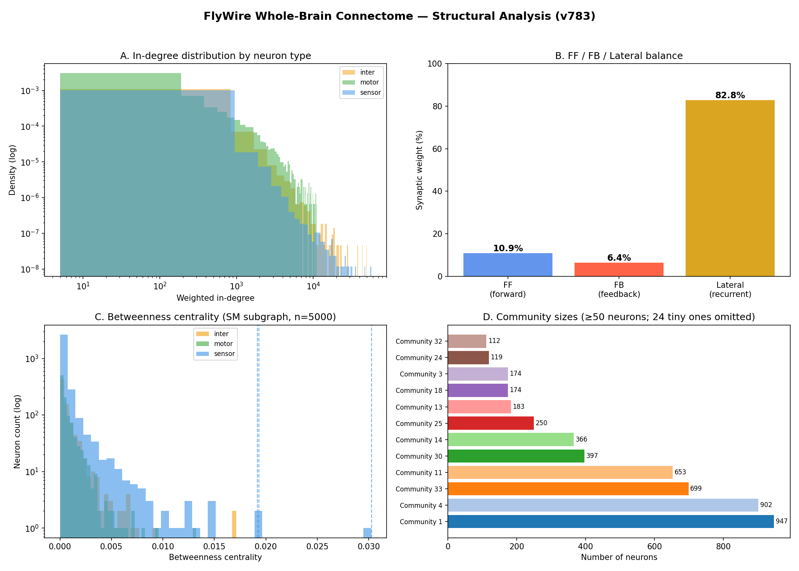
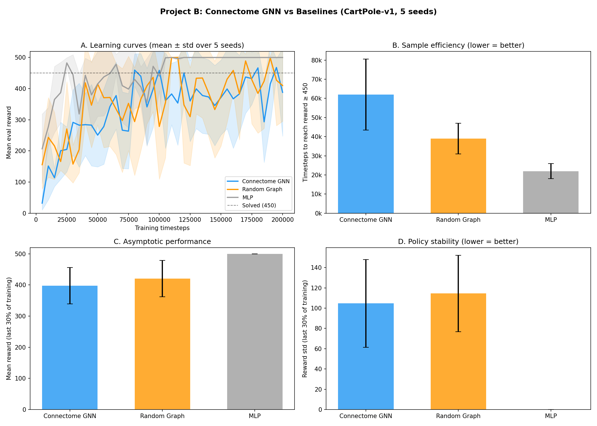

# Connectome as Controller Prior

**Using the adult *Drosophila* whole-brain connectome as a structural prior for embodied GNN controllers.**

This project sits at the intersection of computational neuroscience, graph neural networks, and reinforcement learning. It asks a concrete question: *does the wiring structure of a real biological brain encode useful inductive biases for learning motor control?*

---

## What This Project Does

### Project A — Structural Analysis of the FlyWire Connectome

Downloads and analyses the [FlyWire v783](https://zenodo.org/records/10676866) whole-brain connectome of an adult *Drosophila melanogaster* — the most complete annotated brain connectome ever published (Dorkenwald et al., *Nature*, 2024). Treats 134,013 neurons and 2.7 million synaptic connections as a directed weighted graph and quantifies the structural features relevant to controller design.

**Key findings:**

| Metric | Value | Implication for control |
|--------|-------|-------------------------|
| Feedforward weight fraction | **10.9%** | Only ~11% of synaptic weight flows sensor→motor |
| Feedback weight fraction | **6.4%** | Significant backward loop structure |
| Lateral / recurrent fraction | **82.8%** | Dominant within-layer recurrence — built-in temporal memory |
| Global Reaching Centrality | **0.014** | Near-zero hierarchy; the brain is NOT a feedforward pipeline |
| Functional communities (≥50 neurons) | **12** | Identifiable modular structure |
| Max betweenness centrality | **0.030** | Small number of bottleneck hub neurons |

### Project B — Connectome-shaped GNN Controller

Implements a 30-node GNN controller whose fixed adjacency matrix mirrors the toy connectome topology (sensor / inter / motor node types, feedforward + feedback + lateral edges). Trains with PPO on CartPole-v1 and compares against two controlled baselines.

**Architectures compared (5 random seeds each):**

| Architecture | Params | Graph | Solve step | Final reward | Stability |
|-------------|--------|-------|-----------|-------------|-----------|
| ConnectomeGNN | 2,306 | Biological topology | 62k ± 19k | 388 ± 141 | unstable |
| Random Graph | 2,306 | Erdős–Rényi (same n, same edges) | 39k ± 8k | 410 ± 115 | unstable |
| MLP | 1,355 | No graph structure | **22k ± 4k** | **500 ± 0** | **stable** |

**Finding:** MLP converges fastest and most stably on CartPole. The connectome GNN is the slowest. This is a meaningful negative result — the 82.8% recurrent structure that provides temporal memory capacity is a *liability* on reactive tasks that require no memory. This refines the hypothesis: connectome topology should benefit tasks requiring multi-sensory temporal integration, not pure reflex control.

---

## Why This Matters

Recent work ([FlyGM, arXiv 2602.17997](https://arxiv.org/abs/2602.17997); [flyGNN, NeurIPS 2025](https://neurips.cc/virtual/2025/loc/san-diego/131402)) showed that instantiating the full *Drosophila* connectome as a recurrent GNN and training it with RL produces whole-body locomotion in a biomechanical simulator — outperforming MLP, random, and rewired baselines on sample efficiency. These results suggest biological wiring encodes something computationally useful.

This project is an independent small-scale reproduction and extension: it quantifies *which* structural features of the connectome are present (Project A), then tests *whether* those features confer a learning advantage on a controlled RL task (Project B). The negative result on CartPole sharpens the hypothesis and points to the right experimental domain for future work.

---

## Repository Structure

```
.
├── data/
│   ├── toy_connectome_nodes.csv      # 30-node synthetic graph (sensor/inter/motor)
│   ├── toy_connectome_edges.csv      # Toy edges: FF weight=1.0, lateral=0.6, FB=0.15-0.25
│   └── real/                         # FlyWire v783 data (downloaded by scripts/download_data.py)
│       ├── proofread_connections_783.feather   # 2.7M synaptic connections (852 MB)
│       ├── node_types.csv            # sensor/inter/motor classification (139k neurons)
│       ├── betweenness_results.csv   # Betweenness centrality (5k SM subgraph)
│       ├── community_results.csv     # Louvain community assignments (36 communities)
│       ├── controller_prior_report.txt  # Architecture spec derived from Project A
│       └── fig0_summary.png          # 4-panel structural analysis figure
│
├── src/
│   ├── connectome_gnn.py             # ConnectomeController — pure PyTorch GNN
│   ├── random_graph_gnn.py           # RandomGraphController — same arch, random adjacency
│   ├── mlp_baseline.py               # MLPController — matched parameter count
│   ├── train_connectome.py           # Single-seed training (Prompt B2)
│   ├── train_baselines.py            # Both baselines (Prompt B3)
│   ├── multiseed_train.py            # 5-seed experiment (Prompt B4, resumable)
│   └── plot_results.py               # Generates fig_project_b_comparison.png
│
├── results/
│   ├── fig_project_b_comparison.png  # Main result: 4-panel comparison figure
│   ├── connectome_seed{N}.npy        # Per-seed training curves (connectome)
│   ├── random_seed{N}.npy            # Per-seed training curves (random)
│   └── mlp_seed{N}.npy               # Per-seed training curves (MLP)
│
├── models/                           # Saved PPO models (.zip, loadable by SB3)
├── notebooks/
│   ├── minimal_structural_analysis.ipynb   # Toy graph analysis walkthrough
│   └── project_a_real_connectome.ipynb     # Real FlyWire analysis
├── scripts/
│   └── download_data.py              # Downloads FlyWire v783 from Zenodo
└── references/
    └── sources.json                  # Verified URLs for all papers and datasets
```

---

## Quick Start

### Project B (no data download needed)

```bash
git clone <this-repo>
cd connectome-controller-prior
pip install torch stable-baselines3[extra] gymnasium pandas numpy matplotlib

# Train all 3 architectures × 5 seeds (resumable)
python src/multiseed_train.py

# Generate comparison figure
python src/plot_results.py
```

### Project A (requires ~1.1 GB download)

```bash
python scripts/download_data.py          # ~15-30 min depending on connection
jupyter notebook notebooks/project_a_real_connectome.ipynb
```

### Load a trained model

```python
from stable_baselines3 import PPO
model = PPO.load("models/connectome_seed42_best/best_model")
# Run in CartPole-v1
```

---

## ConnectomeController Architecture

The core GNN mirrors [FlyGM (arXiv 2602.17997)](https://arxiv.org/abs/2602.17997) at small scale:

```
Observation (4-dim)
      │
      ▼  Linear(4→32)
 ┌────────────┐
 │  Sensor ×6 │  ← afferent nodes (receive environment observations)
 └─────┬──────┘
       │  message passing (fixed connectome adjacency, 2 rounds)
       │  H_new = Tanh(MLP([H; A·H]))
 ┌─────▼──────┐
 │  Inter ×18 │  ← intrinsic nodes (82.8% lateral recurrence)
 └─────┬──────┘
       │
 ┌─────▼──────┐
 │  Motor ×6  │  ← efferent nodes (produce action)
 └─────┬──────┘
       │  mean pool + Linear(32→2)
       ▼
   Action logits
```

**Key design choices from Project A:**
- Fixed adjacency: structure is a prior, not a learned parameter
- Both feedback (motor→inter) and lateral (inter→inter) edges retained
- Column-normalised weights from toy CSV (weight ∝ synapse count)
- 2 message-passing steps ≈ sensor→inter→motor path length

---

## Research Questions This Project Opens

1. **Task dependence of biological priors**: Does the connectome topology advantage appear on tasks requiring temporal integration (LunarLander, locomotion) but not on reactive tasks (CartPole)? The current result motivates this experiment.

2. **Structural ablations**: Which specific features drive performance — feedback edges? lateral recurrence? hub node width? The framework supports clean ablations by modifying the toy adjacency CSV.

3. **Scaling to real subgraphs**: The 5,000-node sensorimotor subgraph from Project A (`data/real/sm_subgraph_edges.csv`) can replace the toy graph. Does using a real biological subgraph (vs a toy proxy) change the result?

4. **Sparse fixed-topology networks**: The connectome graph is extremely sparse (density < 0.02%). This relates to lottery ticket and sparse training literature — can a fixed sparse biological prior match or beat a dense trained network?

5. **Community structure as modular sub-policies**: Project A found 12 large functional communities. Can these be used to implement hierarchical RL, where a meta-controller activates different community modules for different sub-tasks?

---

## Key References

| Paper | Relevance |
|-------|-----------|
| Dorkenwald et al. 2024, *Nature* | The FlyWire connectome dataset used in Project A |
| Lin et al. 2024, *Nature* 634:153 | Network statistics methodology replicated in Project A |
| FlyGM, arXiv 2602.17997 | Architecture template for ConnectomeController |
| flyGNN, NeurIPS 2025 | Earlier version; shows whole-body locomotion from connectome GNN |

Full reference list with verified URLs: [`references/sources.json`](references/sources.json)

---

## Results

### Project A — Connectome Structural Analysis



### Project B — Controller Comparison



---

*This project was developed as part of an application to the Princeton Neuroscience Institute Summer Internship Program (FlyWire / Murthy lab, computational connectomics). The long-term direction is using whole-brain connectomics as a structural prior for embodied AI agents.*
